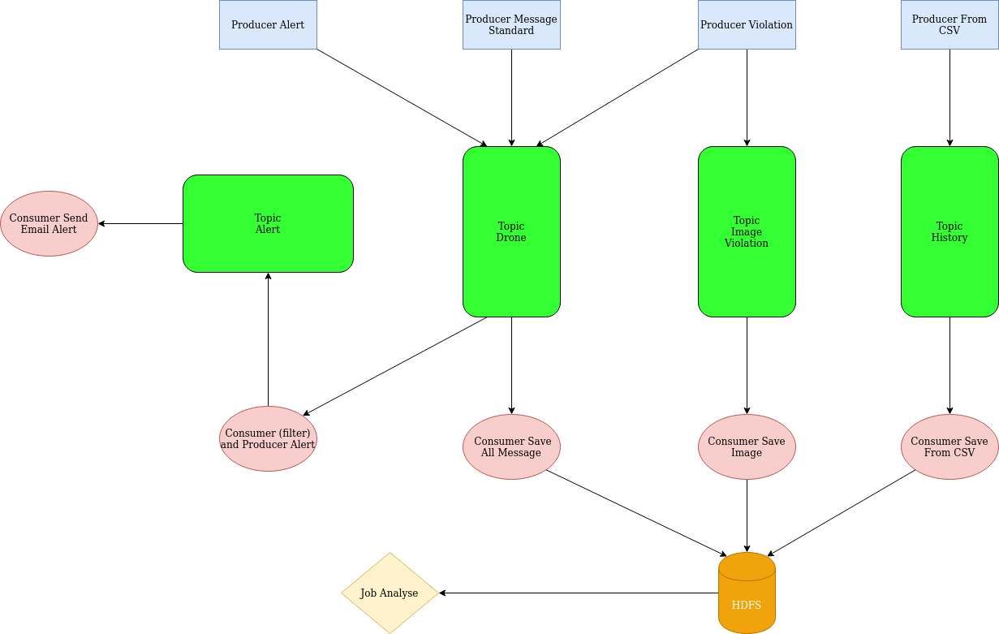

# PrestaCop

## Run file Run_kafka.sh :
- run a hadoop cluster 
- create all repositorie in HDFS
- run Zookeeper 
- run a kafka server 
- create all topics 

## How to run the project ? :
- Run all Consumers first 
- Run All producer
- Wait few minutes 
- Run Analyse Jobs

## Architecture :

